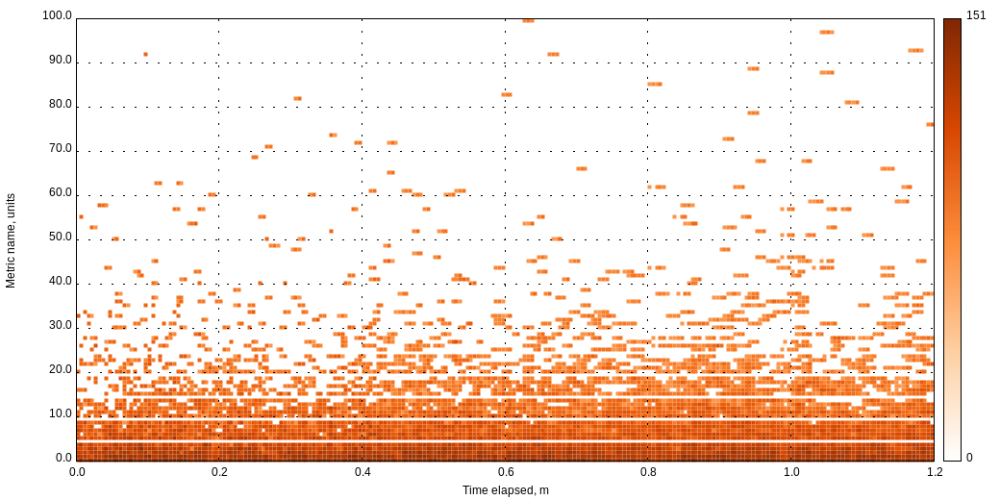

perfkeeper
==========

  

**perfkeeper** is a storage for performance measurements. It's fast, flexible and reliable.

Why?
----
There are many beautiful systems like [cube](https://github.com/square/cube). Unfortunately most of them were designed for continuous monitoring and essentially implement different requirements. Other time series databases such as [KairosDB](https://github.com/kairosdb/kairosdb) or [OpenTSDB](http://opentsdb.net/) are overcomplicated or have impractical dependencies. Let's put it this way, **perfkeeper** is the best choice if all great features of [InfluxDB](http://influxdb.com/) are not needed yet.

**perfkeeper** was created to address daily needs of performance benchmarking. It allows to maintain arbitrary samples collected during relatively short period of time. All samples are grouped by data source (e.g., OS stats or database metrics). In turn, sources are grouped within data snapshot which represents single benchmarking iteration. There are no reducers, you get data as it is.

It's built on top of very fast components. All samples are automatically indexed and queries are nearly instantaneous. Interaction with storage is implemented via simple REST API. There are asynchronous and fully concurrent handlers behind every endpoint, so that your requests will never wait.

Storing samples
---------------

Let's say you collect CPU stats every 5 seconds, each sample is represented by a JSON object or document:

    {
        "cpu_sys": 12.3,
        "cpu_user": 50.4,
        "cpu_idle": 37.3
    }

You can persist your measurements by sending the following HTTP request:

    $ curl -XPOST http://localhost:8080/mybenchmark/app1 -d @sample.json

Where:

  `mybenchmark` is a common snapshot entity (time series database). You should change it before *any* test or benchmark iteration.

   `app1` is a source name. In this case we are using application name, it can be an IP address (e.g., "172.23.100.96") or name of database (e.g., "mydatabase@127.0.0.1").

   `sample.json` is the JSON document which we described above.

Querying samples
----------------

It cannot be simpler:

    $ curl http://localhost:8080/mybenchmark/app1/cpu_sys

Output is a JSON document as well:

    {
        "1403736306507708119": 12.3,
        "1403736306629829527": 71.4
    }

where `1403736306507708119` is sample timestamp (the number of nanoseconds elapsed since January 1, 1970 UTC).

Listing snapshots, sources and metrics
------------------------------------------

In order to list all snapshots:

    $ curl http://localhost:8080/

In order to list all sources for given snapshot:

    $ curl http://localhost:8080/mybenchmark

Getting a list of distinct metrics:

    $ curl http://localhost:8080/mybenchmark/app1

Summary and visualization
-------------------------

This API returns JSON document with aggregated metrics:

    $ curl http://localhost:8080/mybenchmark/app1/cpu_sys/summary

output:

    {
        "avg": 34.2,
        "count": 1000,
        "max": 87.1,
        "min": 0.1,
        "p50": 37.3,
        "p80": 52.4,
        "p90": 72.5,
        "p95": 81.7,
        "p99": 85.2
    }

Built-in heat map graphs in SVG format (use your browser to view):

    http://localhost:8080/mybenchmark/app1/cpu_sys/heatmap

Wait, how to install it?
------------------------

The latest stable **perfkeeper** binaries are available on [Releases](https://github.com/pavel-paulau/perfkeeper/releases) page.

To build the latest development version you need [Go](http://golang.org/doc/install). Getting the latest **perfkeeper**:

    $ go get github.com/pavel-paulau/perfkeeper

Running it:

    $ perfkeeper

The command above will start HTTP listener on port 8080.
